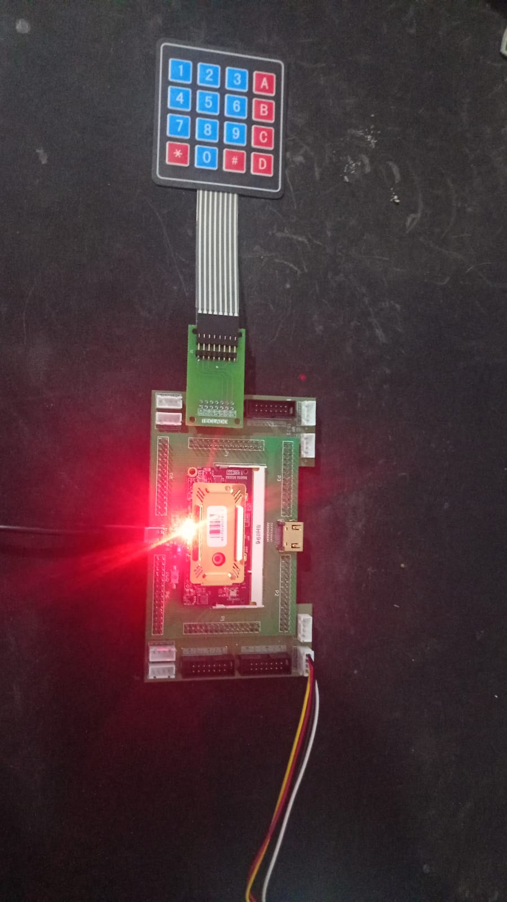
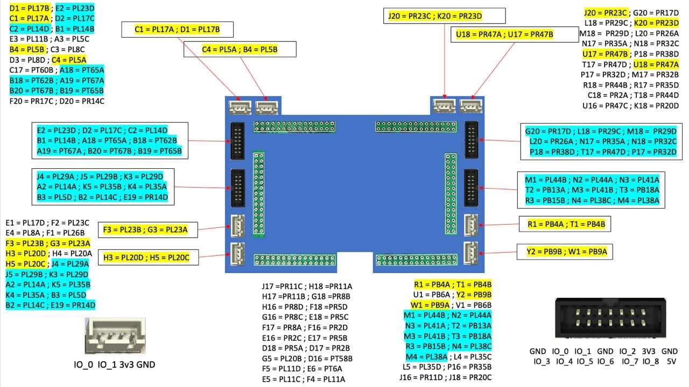
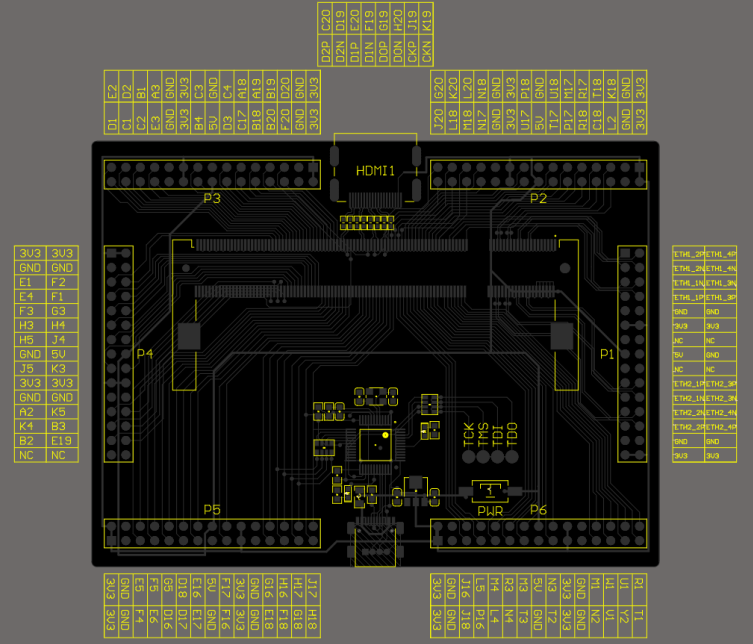
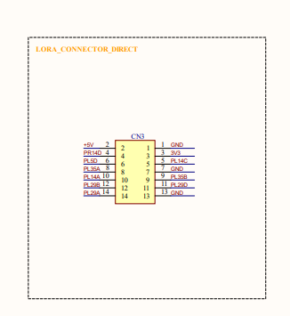

# Projeto CodLok com FPGA - EmbarcaTech

O CodLok é um sistema desenvolvido para FPGA que controla o acesso através de uma senha numérica. Quando a senha correta é digitada, um LED é acionado, indicando acesso liberado.

## Autor

Wallace Ribeiro Benites

## 🎯 Funcionalidades

- Senha de 6 dígitos
- LED indicador
- Feedback visual
- Cancelamento - Tecla # para cancelar a operação

## 🌐 Visão Geral

### Estrutura do Código

O sistema foi desenvolvido em Verilog e organizado em quatro arquivos principais:

- `codlok.v` - Código principal do sistema
- `tb_codlok.v` - Testbench para simulação
- `codlok_top.v` - Módulo topo para FPGA
- `keypad_controller.v` - Controlador do teclado matricial

### Estados do Sistema

| Estado          | Descrição                          |
|-----------------|------------------------------------|
| IDLE            | Aguardando início da digitação    |
| PASSWORD_ENTRY  | Capturando os dígitos da senha    |
| ACCESS_GRANTED  | Acesso concedido (LED ligado)     |
| ACCESS_DENIED   | Acesso negado (LED piscante)      |

## 🛠️ Testbench

Foram executados 5 testes completos para validar o sistema:

- Teste 1 - Senha Correta
- Teste 2 - Senha Incorreta
- Teste 3 - Cancelamento
- Teste 4 - Senha Incompleta
- Teste 5 - Teclas Inválidas

### Como Executar o Testbench

**Pré-requisitos:**
- Icarus Verilog instalado
- Sistema Linux (testado no Ubuntu)

**Comandos para Simulação:**

```bash
# Clone o repositório
git clone https://github.com/FPGA-2025/lab99-ProjetoFinal-wallaceeBenites

# Entre na pasta do projeto
cd lab99-ProjetoFinal-wallaceeBenites

# Execute a simulação
make sim
```

### Saída Esperada da Simulação

Abaixo está um exemplo da saída esperada ao executar o testbench:

```
mkdir -p build
mkdir -p logs
Compilando projeto...
iverilog -o build/codlok_sim src/tb_codlok.v src/codlok.v
Executando simulação...
==========================================
    TESTE DO CODLOK - SIMULADOR
    SENHA CORRETA: 000123
==========================================
[ESTADO] IDLE

=== TESTE 1: Senha Correta (000123) ===
[CODLOK] Primeiro dígito: 0
[PROGRESSO] Dígitos digitados: 1/6
[ESTADO] PASSWORD_ENTRY
--- Tecla: 0 ---
[CODLOK] Dígito 2: 0
[PROGRESSO] Dígitos digitados: 2/6
--- Tecla: 0 ---
[CODLOK] Dígito 3: 0
[PROGRESSO] Dígitos digitados: 3/6
--- Tecla: 0 ---
[CODLOK] Dígito 4: 1
[PROGRESSO] Dígitos digitados: 4/6
--- Tecla: 1 ---
[CODLOK] Dígito 5: 2
[PROGRESSO] Dígitos digitados: 5/6
--- Tecla: 2 ---
[CODLOK] Dígito 6: 3
[PROGRESSO] Dígitos digitados: 6/6
[CODLOK] === VERIFICAÇÃO FINAL ===
[CODLOK] Senha digitada: 000123
[CODLOK] Senha correta:  000123
[CODLOK] *** SENHA CORRETA! ACESSO CONCEDIDO ***
[EVENTO] >>> ACESSO CONCEDIDO! <<<
[ESTADO] ACCESS_GRANTED
--- Tecla: 3 ---
[CODLOK] Tempo expirado
[ESTADO] IDLE

=== TESTE 2: Senha Incorreta (000122) ===
[CODLOK] Primeiro dígito: 0
[PROGRESSO] Dígitos digitados: 1/6
[ESTADO] PASSWORD_ENTRY
--- Tecla: 0 ---
[CODLOK] Dígito 2: 0
[PROGRESSO] Dígitos digitados: 2/6
--- Tecla: 0 ---
[CODLOK] Dígito 3: 0
[PROGRESSO] Dígitos digitados: 3/6
--- Tecla: 0 ---
[CODLOK] Dígito 4: 1
[PROGRESSO] Dígitos digitados: 4/6
--- Tecla: 1 ---
[CODLOK] Dígito 5: 2
[PROGRESSO] Dígitos digitados: 5/6
--- Tecla: 2 ---
[CODLOK] Dígito 6: 2
[PROGRESSO] Dígitos digitados: 6/6
[CODLOK] === VERIFICAÇÃO FINAL ===
[CODLOK] Senha digitada: 000122
[CODLOK] Senha correta:  000123
[CODLOK] *** SENHA INCORRETA! ACESSO NEGADO ***
[EVENTO] >>> ACESSO NEGADO! <<<
[ESTADO] ACCESS_DENIED
--- Tecla: 2 ---
[ESTADO] IDLE

=== TESTE 3: Cancelamento com # ===
[CODLOK] Primeiro dígito: 1
[PROGRESSO] Dígitos digitados: 1/6
[ESTADO] PASSWORD_ENTRY
--- Tecla: 1 ---
[CODLOK] Dígito 2: 2
[PROGRESSO] Dígitos digitados: 2/6
--- Tecla: 2 ---
[CODLOK] Cancelado com #
[ESTADO] IDLE
--- Tecla: b ---

=== TESTE 4: Senha Curta (apenas 3 dígitos) ===
[CODLOK] Primeiro dígito: 1
[PROGRESSO] Dígitos digitados: 1/6
[ESTADO] PASSWORD_ENTRY
--- Tecla: 1 ---
[CODLOK] Dígito 2: 2
[PROGRESSO] Dígitos digitados: 2/6
--- Tecla: 2 ---
[CODLOK] Dígito 3: 3
[PROGRESSO] Dígitos digitados: 3/6
--- Tecla: 3 ---

=== TESTE 5: Teclas Não Numéricas ===
--- Tecla: a ---
--- Tecla: c ---
--- Tecla: d ---

==========================================
         FIM DOS TESTES
==========================================
src/tb_codlok.v:113: $finish called at 25610000 (1ps)

Simulação concluída! Verifique logs/simulation.log
```

## Utilizando na FPGA

### Montagem do Projeto



### A pinagem foi baseada nessas imagens para utilizar o adaptador do teclado do kit:





### Arquivo LPF

```
# Clock
LOCATE COMP "clk" SITE "P3";
IOBUFFER PORT "clk" IO_TYPE=LVCMOS33;
FREQUENCY PORT "clk" 25.0 MHz;

# LED
LOCATE COMP "led" SITE "L2";
IOBUFFER PORT "led" IO_TYPE=LVCMOS33;

# Keypad Rows (entradas)
LOCATE COMP "row[0]" SITE "J4";
IOBUFFER PORT "row[0]" IO_TYPE=LVCMOS33;
LOCATE COMP "row[1]" SITE "J5";
IOBUFFER PORT "row[1]" IO_TYPE=LVCMOS33;
LOCATE COMP "row[2]" SITE "A2";
IOBUFFER PORT "row[2]" IO_TYPE=LVCMOS33;
LOCATE COMP "row[3]" SITE "K4";
IOBUFFER PORT "row[3]" IO_TYPE=LVCMOS33;

# Keypad Columns (saídas)
LOCATE COMP "col[0]" SITE "B3";
IOBUFFER PORT "col[0]" IO_TYPE=LVCMOS33;
LOCATE COMP "col[1]" SITE "E19";
IOBUFFER PORT "col[1]" IO_TYPE=LVCMOS33;
LOCATE COMP "col[2]" SITE "K3";
IOBUFFER PORT "col[2]" IO_TYPE=LVCMOS33;
LOCATE COMP "col[3]" SITE "K5";
IOBUFFER PORT "col[3]" IO_TYPE=LVCMOS33;
```
## Como Utilizar

**Síntese com Yosys**

```
yosys -p "read_verilog src/codlok.v src/keypad_controller.v src/codlok_top.v; synth_ecp5 -json build/codlok.json -abc9"
```

**Place & Route com NextPnR**
```
nextpnr-ecp5 --json build/codlok.json --lpf codlok.lpf --textcfg build/codlok.config --package CABGA381 --45k --speed 6
```

**Gerar Bitstream**
```
ecppack --compress --input build/codlok.config --bit build/codlok.bit
```

**Carregar na FPGA**
```
openFPGALoader -b colorlight-i9 build/codlok.bit
```


## Vídeo do Funcionamento

[Assista ao vídeo demonstrativo](https://www.youtube.com/watch?v=rOIuPmm22Kc)

## Observações e Desafios

Infelizmente, só consegui fazer o sistema funcionar uma vez (como mostrado no vídeo). O funcionamento não foi consistente, indicando possíveis problemas:

Pinagem incorreta - Mapeamento dos pinos pode não estar adequado

Placa extensora - Possível incompatibilidade com o adaptador do teclado

Timing issues - Problemas de sincronização com o teclado

Soluções Alternativas
Caso os problemas persistam, as alternativas são:

Conexão direta - Ligar fios diretamente nos pinos da FPGA

Teste com LEDs - Verificar individualmente cada pino

Multímetro - Confirmar continuidade dos circuitos

## Estrutura do Projeto

```
lab99-ProjetoFinal-wallaceeBenites/
├── src/
│   ├── codlok.v              # Código principal
│   ├── codlok_top.v          # Módulo topo FPGA
│   ├── keypad_controller.v   # Controlador teclado
│   └── tb_codlok.v           # Testbench
├── assets/                   # Imagens e recursos
├── codlok.lpf               # Configuração pinos
├── Makefile                 # Automação
└── README.md               # Documentação
```
